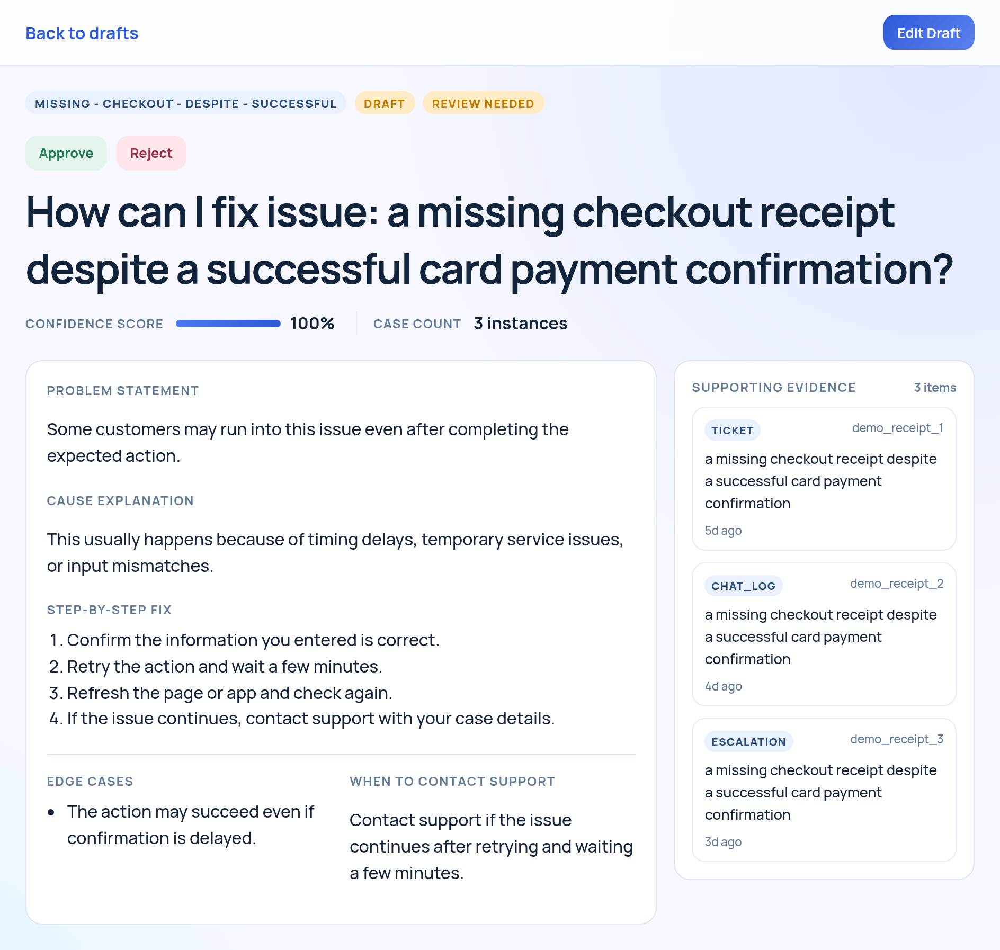
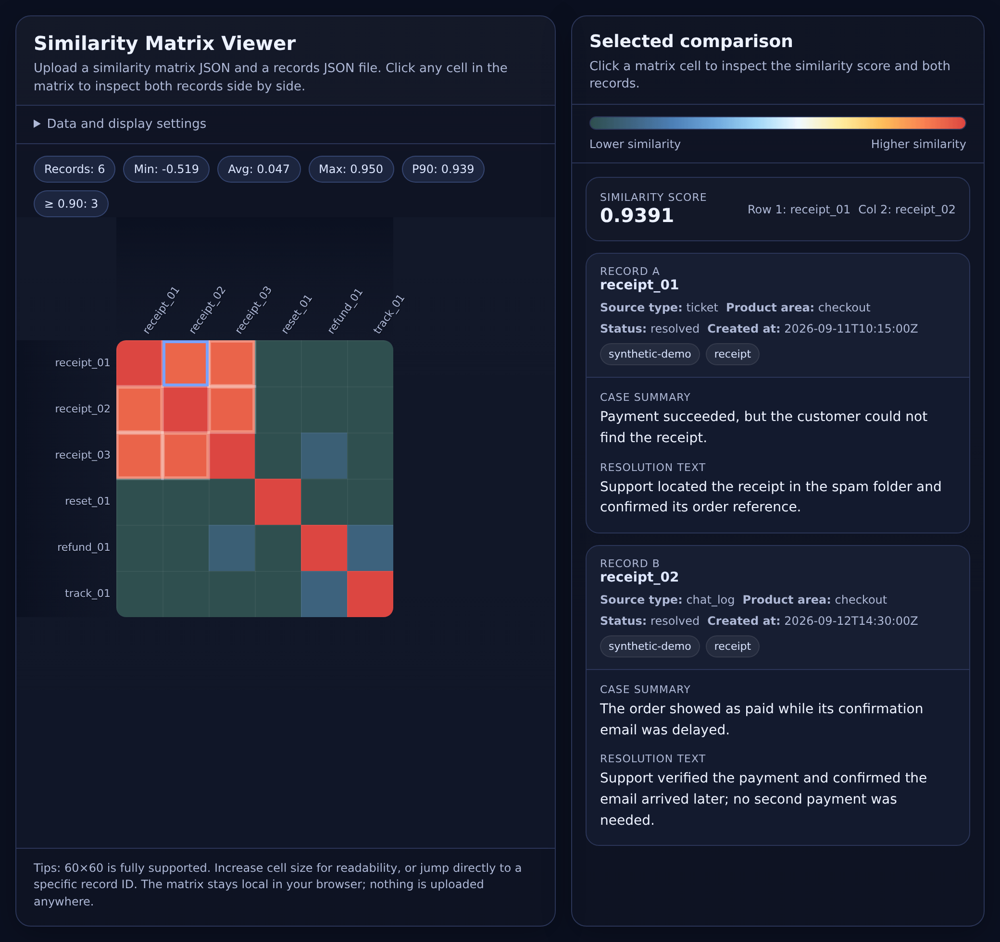

# SupportAI

SupportAI helps support teams write answers to frequently asked questions (FAQs) using cases they've already solved. The idea is to reuse what the team has learned instead of writing the same explanations from scratch.

It groups similar cases and drafts an answer from their solutions. You can read the original cases next to the draft, edit the text, and approve or reject it.

## Example

In this demo, three customers have paid but can't find their receipts. Support finds one in spam, confirms that another email arrived late, and resends the third after checking the customer's email address.

The cases are grouped under “My payment went through. Where is my receipt?” The draft brings those solutions together and explains that a missing receipt doesn't mean the customer needs to pay again.

*The screenshots use fictional cases with prepared comparisons and a prewritten answer. The demo returns the same results each time. “Confidence” refers to how similar the cases are, not whether the answer is correct.*

The comparison view lets you look at two cases side by side. Here, they describe the same problem but have different solutions.

## Current limits

This is an early version that runs on your own computer.

- Work isn't saved permanently. Restarting the service clears drafts; reloading the page clears edits and review decisions. Generating drafts again replaces the previous work.
- Approval only marks an answer as reviewed. There's no export or publishing yet.
- Cases must be supplied as files in the required format. The app doesn't connect to support tools automatically.
- There's no login or access protection. Answer quality, grouping, and speed haven't been formally evaluated.

Suggestions for updating existing documentation are planned but aren't built yet.

## Try it

You can try the prepared demo without an AI service. For AI-generated answers from your own cases, the app uses Google's Gemini. That sends the case text to Google, and the answers still need checking.

The app is available in English and Brazilian Portuguese. Installation takes some technical setup, covered in the [setup guide](docs/developer-reference.md).
